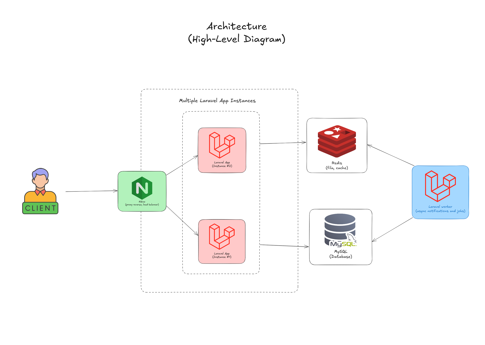

# Financial Transactions API

## Overview

**A backend system for handling financial transactions, designed for concurrency, scalability, and high availability.** Supports deposits and transfers between regular users and merchants, featuring external validations, asynchronous notifications, strict transactional control, and idempotency support.

---

## Tech Stack

-   **Laravel** – PHP framework for building robust RESTful APIs
-   **Docker** – Service containerization and orchestration
-   **Nginx** – Reverse proxy and load balancer (least_conn algorithm)
-   **MySQL** – Relational database with ACID transaction support
-   **Redis** – In-memory caching and job queueing
-   **Laravel Horizon** – Monitoring for job queues and async processing

---

## Architecture

### High-Level Diagram



-   **Load balancer (Nginx)** - Distributes incoming requests across app instances
-   **Multiple Laravel App Instances** - Ensures horizontal scalability
-   **MySQL Database** - Manages data integrity with pessimistic locking
-   **Redis** - Used for caching, queueing and idempotency key
-   **Queue System (Horizon)** - Handles asynchronous jobs and background processing

### Database Modeling


### Deadlock Handling Strategy


The system uses **deterministic locking** order to avoid deadlocks. Resources are always locked in the same order, regardless of transaction direction.

For example, when transferring between Wallet 1 and Wallet 2, the wallet with the lowest ID is always locked first — ensuring only one transaction accesses those records at a time, effectively eliminating deadlocks.

---

## Features

### Deposits

-   Clean layering: Controller → DTO → Service
-   Monetary values handled in cents (integers) to avoid floating-point issues
-   Optional pessimistic locking via feature flag
-   Built-in idempotency to prevent duplicate execution on retries
-   Includes simulation scripts for concurrent operations

### Transfers

-   Balance validation and external authorization via mocked (`/authorize`)
-   Safe integer-based money handling with automatic conversion
-   Fully ACID-compliant transaction with rollback support
-   Deterministic resource locking for concurrency control
-   Built-in idempotency to prevent duplicate execution on retries
-   Scripts provided for testing concurrency and deadlocks

### Asynchronous Notifications

-   Sends POST requests to external mock (`/notify`)
-   Executed in background with retry and exponential backoff
-   Decoupled from core business logic

### Asynchronous Logging

-   Dedicated middleware captures requests and responses
-   Logs are processed via job queues to avoid affecting response time

---

## API Documentation

### POST api/transactions/deposit

Deposits funds into a user wallet.

**Request**

```json
{
    "payer_id": 1,
    "value": 10.5
}
```

**Response**

```json
{
    "message": "Deposit processed successfully.",
    "transaction": {
        "transaction_id": 14,
        "payer_id": 1,
        "payee_id": 1,
        "type": "deposit",
        "amount": 10.5,
        "created_at": "2025-06-11T08:52:25.000000Z"
    },
    "wallet": {
        "user_id": 1,
        "balance": 10.5
    }
}
```

### POST api/transactions/transfer

Transfers funds between users.

**Request**

```json
{
    "payer_id": 1,
    "payee_id": 2,
    "value": 0.5
}
```

**Response**

```json
{
    "message": "Transfer processed successfully.",
    "transaction": {
        "transaction_id": 15,
        "payer_id": 1,
        "payee_id": 2,
        "type": "transfer",
        "amount": 0.5,
        "created_at": "2025-06-11T08:59:04.000000Z"
    },
    "wallet": {
        "user_id": 1,
        "balance": 99.5
    }
}
```

---

## Testing

-   **Coverage:** Integration and concurrency tests via scripts
-   **Included scripts:**
    -   `1_concurrent_deposit_test.sh`
    -   `2_concurrent_transfer_test.sh`
    -   `3_concurrent_transfer_deadlocking_test.sh`
    -   `4_mass_simulate-idempotent-requests.sh`

---

## Code Quality

-   **Pint (PSR-12):** Auto-formatting and linting
-   **PHPStan (Larastan):** Static analysis with strict levels
-   **PHP Mess Detector:** Detects code smells and complexity
-   **Hooks de pré-commit:** Automatically run Pint before commits

### Common Commands

```bash
# Runt tests
docker compose exec app1 php artisan test
docker compose exec app1 php artisan test --coverage

# Linting
docker compose exec app1 composer run lint
docker compose exec app1 composer run fix

# Static analysis and code smells
docker compose exec app1 composer run stan
docker compose exec app1 composer run md
```

## Documentation & Monitoring

-   Swagger UI: [`localhost/api/documentation`](http://localhost/api/documentation)
-   Horizon Dashboard: [`localhost/horizon`](http://localhost/horizon)
-   Log Viewer: [`localhost/log-viewer`](http://localhost/log-viewer)

```bash
# Generate Swagger docs
docker compose exec app1 composer run swagger

# Publish log viewer assets
docker compose exec app1 composer run log-viewer

```

---

## Installation

### Prerequisites

-   [Docker](https://www.docker.com/)
-   [Docker Compose](https://docs.docker.com/compose/)
-   [Git](https://git-scm.com/)

### Steps

Clone this repository:

```bash
git clone https://github.com/seu-usuario/simplebank.git
cd simplebank
```

Copy the example .env file:

```bash
cp .env.example .env
```

Edit the .env file. Default values:

```bash
# MySQL
DB_CONNECTION=mysql
DB_HOST=mysql
DB_PORT=3306
DB_DATABASE=simplebank
DB_USERNAME=user
DB_PASSWORD=password

# Redis
CACHE_STORE=redis
REDIS_CLIENT=phpredis
REDIS_HOST=redis
REDIS_PASSWORD=null
REDIS_PORT=6379

# Concurrency flags
USE_PESSIMISTIC_LOCK=true
AVOID_DEADLOCK=true

# External services
TRANSACTION_AUTHORIZER_SERVICE_URL="https://util.devi.tools/api/v2"
NOTIFICATION_SERVICE_URL="https://util.devi.tools/api/v1"
```

Start containers

```
docker compose up -d
```

(Optional) Tail logs

```
docker compose logs -f
```

---

## Melhorias Futuras

-   [ ] Add a repository layer with cache
-   [ ] Increase unit test coverage across layers
-   [ ] Improve architecture (Clean, Onion, Hexagonal)
-   [ ] Scheduled transfers
-   [ ] Asynchronous transactions with UUID tracking
-   [ ] Integration with observability stack (Logs, Traces, Telemetry)
-   [ ] Automated load testing using specialized tools
-   [ ] Explore NoSQL alternatives for specific use cases
-   [ ] Improve message queue and broker implementations

---

This project was developed as a proof of concept for a simplified financial platform.
It emphasizes backend best practices, transactional reliability, and observability.
